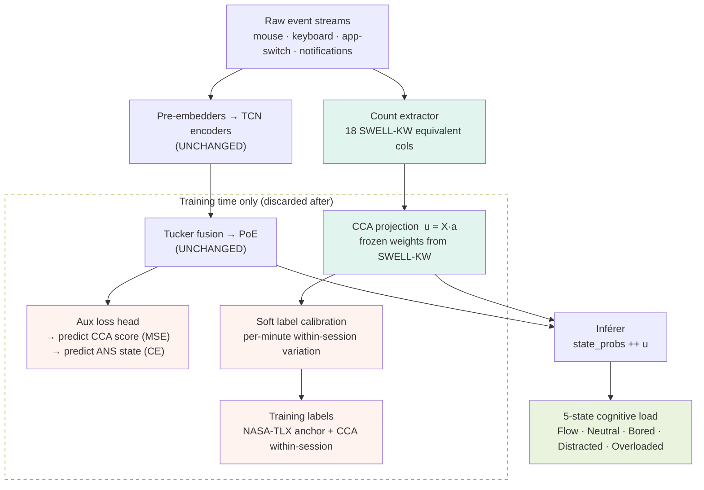

# AAM Fusion Model — Physiological Grounding via SWELL-KW
## Architecture integration guide

---

## Context

### What problem this solves

AAM's fusion model has two entangled problems that block meaningful training:

**Label quality.** NASA-TLX gives one subjective score per session (~45 minutes). Every 30-second window in that session gets the same label. The model sees no within-session cognitive load variation — it can't learn to distinguish Flow from Overloaded happening in the same session because both get the same label.

**Validation gap.** There is no way to verify that the features the pre-embedders extract are tracking anything physiologically real. The model could be learning spurious correlations in the training data with no way to detect it.

### What we found (biosignal validation experiments)

We ran a series of cross-modal experiments on SWELL-KW (25 knowledge workers, 3 deliberate cognitive load conditions) using their pre-extracted per-minute behavioral features alongside concurrent HR, RMSSD, and SCL measurements.

Key results:

| Signal | Accuracy | Chance | Note |
|---|---|---|---|
| HR direction (rising/falling) | 79.0% | 50% | from HCI deltas |
| RMSSD magnitude class | 84.7% | 33% | strong/flat/fall |
| ANS compound state | 61.6% | 25% | stress/active/recovery/fatigue |
| CCA canonical correlation | r = 0.58 | — | CV on held-out data |

The CCA result is the most important one. Canonical Correlation Analysis on 75 condition-level rows found that a linear combination of 18 behavioral features correlates at r = 0.58 with a linear combination of HR+RMSSD+SCL on held-out data. This means a specific direction in HCI feature space tracks the same cognitive load variation that physiology tracks — and that direction is now encoded in the CCA weight vector **a**.

### What this gives us

- A per-minute continuous cognitive load scalar `u = X · a` computed from behavior alone, validated against physiology (CV r = 0.58)
- Per-minute direction/magnitude predictions for HR and HRV with 79–85% accuracy
- A 4-class ANS state label (stress/active/recovery/fatigue) at 62% accuracy
- All of these derived from the same behavioral event types AAM already captures

### What does NOT change

The pre-embedder → TCN → Tucker → PoE core architecture is untouched. The approach adds:
1. A lightweight count extractor (parallel, ~10 lines)
2. A frozen CCA projection (one dot product)
3. An auxiliary loss head (training time only, discarded after)
4. Soft label calibration (improves `derive_state_label()`)

---

## System overview



---

## Step 1 — Count extractor

This is not a model. It takes the same raw events the pre-embedders receive and produces the 18 SWELL-KW equivalent features per window. These map as follows:

| SWELL-KW column | AAM equivalent | Source |
|---|---|---|
| `SnKeyStrokes` | keystroke count | keyboard events |
| `SnChars` | printable key count | keyboard events |
| `SnErrorKeys` | backspace count | keyboard events |
| `SnSpecialKeys` | special key count | keyboard events |
| `SnDirectionKeys` | arrow key count | keyboard events |
| `SnShortcutKeys` | ctrl/alt combo count | keyboard events |
| `SnSpaces` | space count | keyboard events |
| `CharactersRatio` | printable / total | keyboard events |
| `ErrorKeyRatio` | backspace / total | keyboard events |
| `SnLeftClicked` | left click count | mouse events |
| `SnRightClicked` | right click count | mouse events |
| `SnDoubleClicked` | double click count | mouse events |
| `SnWheel` | scroll event count | mouse events |
| `SnDragged` | drag event count | mouse events |
| `SnMouseDistance` | total pixel distance | mouse events |
| `SnMouseAct` | active seconds / window | mouse events |
| `SnAppChange` | app switch count | switching events |
| `SnTabfocusChange` | tab/window switch count | switching events |

```python
# swell_features.py
import numpy as np

def extract_swell_counts(
    mouse_events,    # list of (x, y, button, timestamp)
    key_events,      # list of (keycode, timestamp)
    switch_events,   # list of (app_name, timestamp)
    window_sec=60
) -> np.ndarray:
    """
    Compute 18 SWELL-KW equivalent features from raw AAM event streams.
    Returns a (18,) float32 array in the same column order as SWELL-KW.
    """
    # ── keyboard ──────────────────────────────────────────────
    SPECIAL = {8, 9, 13, 27, 32, 45, 46}  # backspace, tab, enter, esc, space, ins, del
    DIRECTION = {37, 38, 39, 40}           # arrow keys
    # keycodes < 32 or in SPECIAL → special; printable → chr(k).isprintable()
    total_keys = len(key_events)
    backspace  = sum(1 for k, _ in key_events if k == 8)
    special    = sum(1 for k, _ in key_events if k in SPECIAL)
    direction  = sum(1 for k, _ in key_events if k in DIRECTION)
    shortcut   = sum(1 for k, _ in key_events if k < 32 and k not in SPECIAL)
    spaces     = sum(1 for k, _ in key_events if k == 32)
    printable  = sum(1 for k, _ in key_events
                     if 32 < k < 127 and k not in SPECIAL)
    chars_ratio  = printable / max(total_keys, 1)
    error_ratio  = backspace  / max(total_keys, 1)

    # ── mouse ─────────────────────────────────────────────────
    left_clicks   = sum(1 for _, _, b, _ in mouse_events if b == "left")
    right_clicks  = sum(1 for _, _, b, _ in mouse_events if b == "right")
    double_clicks = sum(1 for _, _, b, _ in mouse_events if b == "double")
    scrolls       = sum(1 for _, _, b, _ in mouse_events if b == "scroll")
    drags         = sum(1 for _, _, b, _ in mouse_events if b == "drag")

    distance = 0.0
    prev_x, prev_y = None, None
    for x, y, _, _ in mouse_events:
        if prev_x is not None:
            distance += ((x - prev_x)**2 + (y - prev_y)**2) ** 0.5
        prev_x, prev_y = x, y

    active_intervals = sum(
        1 for i in range(1, len(mouse_events))
        if mouse_events[i][3] - mouse_events[i-1][3] < 2.0  # gap < 2s = active
    )
    mouse_act = active_intervals / max(window_sec, 1)

    # ── app switching ─────────────────────────────────────────
    app_changes = max(len(switch_events) - 1, 0)
    tab_changes = sum(1 for a, _ in switch_events if "browser" in a.lower())

    return np.array([
        total_keys, printable, special, direction, backspace,
        shortcut, spaces, chars_ratio, error_ratio,
        left_clicks, right_clicks, double_clicks, scrolls, drags,
        distance, mouse_act,
        app_changes, tab_changes
    ], dtype=np.float32)


SWELL_COL_ORDER = [
    "SnKeyStrokes", "SnChars", "SnSpecialKeys", "SnDirectionKeys",
    "SnErrorKeys", "SnShortcutKeys", "SnSpaces",
    "CharactersRatio", "ErrorKeyRatio",
    "SnLeftClicked", "SnRightClicked", "SnDoubleClicked",
    "SnWheel", "SnDragged", "SnMouseDistance", "SnMouseAct",
    "SnAppChange", "SnTabfocusChange"
]
```

---

## Step 2 — CCA projection (frozen)

The CCA weight vector `a` was fitted offline on SWELL-KW (75 condition-level rows). It is a fixed (18,) vector — not learnable during AAM training. Save it once and load it as a frozen buffer.

```python
# cca_projection.py
import numpy as np
import torch
import torch.nn as nn


class CCAProjection(nn.Module):
    """
    Frozen linear projection: SWELL-KW count features → scalar cognitive load score.
    Weight vector a from CCA component 1 (CV r=0.58 on held-out data).
    Not trained during AAM fusion model training.
    """

    def __init__(self, weights_path: str):
        super().__init__()
        a = np.load(weights_path)                          # shape (18,)
        self.register_buffer("a", torch.tensor(a, dtype=torch.float32))
        # per-user running stats for z-scoring (updated online)
        self.register_buffer("mu", torch.zeros(18))
        self.register_buffer("sigma", torch.ones(18))

    def update_stats(self, X: torch.Tensor):
        """Call with a batch of count features to update running mean/std."""
        self.mu = X.mean(0).detach()
        self.sigma = X.std(0).clamp(min=1e-6).detach()

    def forward(self, X: torch.Tensor) -> torch.Tensor:
        """
        X: (B, 18) raw count features
        returns: (B, 1) CCA cognitive load score
        """
        X_z = (X - self.mu) / self.sigma
        return (X_z @ self.a).unsqueeze(-1)               # (B, 1)
```

To save the weight vector after running the SWELL-KW notebook:

```python
# run once in the biosignals_data notebook after fitting CCA
import numpy as np
from sklearn.cross_decomposition import CCA

# cca is already fitted in the notebook
a_vector = cca.x_weights_[:, 0]   # shape (18,) — component 1
np.save("~/fusion_model/cca_a_vector.npy", a_vector)
```

---

## Step 3 — Auxiliary loss head

This module branches off the Tucker fusion output during training. It is discarded after training — the weights are never used at inference time. Its only job is to regularize the internal representation toward physiologically validated directions.

```python
# aux_loss_head.py
import torch
import torch.nn as nn
import torch.nn.functional as F


class PhysioAuxHead(nn.Module):
    """
    Auxiliary prediction head attached to the Tucker fusion output.
    Predicts:
      - CCA score (regression, MSE loss)
      - ANS compound state (4-class: stress/active/recovery/fatigue, CE loss)

    Discarded after training. Never called at inference.
    """

    ANS_CLASSES = ["stress", "active", "recovery", "fatigue"]
    # maps to HR_rising×2 + RMSSD_rising:
    # 0=HR↓HRV↓ (fatigue)  1=HR↓HRV↑ (recovery)
    # 2=HR↑HRV↓ (stress)   3=HR↑HRV↑ (active)

    def __init__(self, fusion_dim: int = 64):
        super().__init__()
        hidden = fusion_dim // 2
        self.shared = nn.Sequential(
            nn.Linear(fusion_dim, hidden),
            nn.ReLU(),
            nn.Dropout(0.2)
        )
        self.cca_head = nn.Linear(hidden, 1)       # regression → CCA score
        self.ans_head = nn.Linear(hidden, 4)       # 4-class → ANS state

    def forward(self, fusion_out: torch.Tensor):
        """
        fusion_out: (B, fusion_dim)
        returns: dict with 'cca_pred' (B,1) and 'ans_logits' (B,4)
        """
        h = self.shared(fusion_out)
        return {
            "cca_pred":  self.cca_head(h),
            "ans_logits": self.ans_head(h)
        }


def physio_aux_loss(
    preds: dict,
    cca_targets: torch.Tensor,    # (B,) float — CCA scores from SWELL projection
    ans_targets: torch.Tensor,    # (B,) long  — 0/1/2/3 ANS state labels
    cca_weight: float = 0.3,
    ans_weight: float = 0.2
) -> torch.Tensor:
    """
    Combined auxiliary loss. Weights are deliberately small — this is a
    regularizer, not the main objective.
    """
    # only compute on samples where physio labels are available
    cca_mask = cca_targets.isfinite()
    ans_mask  = (ans_targets >= 0)

    loss = torch.tensor(0.0, device=cca_targets.device)

    if cca_mask.any():
        loss_cca = F.mse_loss(
            preds["cca_pred"][cca_mask].squeeze(-1),
            cca_targets[cca_mask]
        )
        loss += cca_weight * loss_cca

    if ans_mask.any():
        loss_ans = F.cross_entropy(
            preds["ans_logits"][ans_mask],
            ans_targets[ans_mask]
        )
        loss += ans_weight * loss_ans

    return loss
```

---

## Step 4 — Soft label calibration

This replaces the session-level NASA-TLX label with a per-minute signal. The CCA score gives within-session variation that NASA-TLX cannot provide.

```python
# soft_labels.py
import numpy as np


def derive_state_label_calibrated(
    nasa_tlx_score: float,    # 0–100, session-level anchor
    cca_score: float,         # per-minute CCA cognitive load scalar
    cca_session_mean: float,  # mean CCA score for this session
    cca_session_std: float,   # std  CCA score for this session
    thresholds: dict = None
) -> int:
    """
    5-state label: 0=Flow 1=Neutral 2=Bored 3=Distracted 4=Overloaded

    Strategy:
      - NASA-TLX anchors the session's overall load level
      - CCA score provides within-session deviation from that anchor
      - Combined signal = NASA-TLX + scaled CCA deviation
    """
    if thresholds is None:
        thresholds = {
            "flow_max":      25,
            "bored_max":     35,
            "neutral_range": (35, 65),
            "distracted_max": 72,
            "overload_min":   72
        }

    # normalise CCA score relative to this session
    if cca_session_std > 0:
        cca_z = (cca_score - cca_session_mean) / cca_session_std
    else:
        cca_z = 0.0

    # blend: NASA-TLX sets the range, CCA shifts within it
    # CCA z ∈ [-2, +2] → shifts effective load by ±10 points
    effective_load = np.clip(nasa_tlx_score + cca_z * 5, 0, 100)

    if effective_load < thresholds["flow_max"]:
        return 0   # Flow
    elif effective_load < thresholds["bored_max"]:
        return 2   # Bored
    elif effective_load < thresholds["neutral_range"][1]:
        return 1   # Neutral
    elif effective_load < thresholds["distracted_max"]:
        return 3   # Distracted
    else:
        return 4   # Overloaded


def compute_session_cca_stats(cca_scores: np.ndarray):
    """Call once per session on the array of per-minute CCA scores."""
    return cca_scores.mean(), cca_scores.std()
```

---

## Step 5 — Fusion model integration

The only change to the existing fusion model is: append `u` to the Inférer input. The Tucker+PoE stack is untouched.

```python
# fusion_model.py  (relevant excerpt — add to existing class)

class AAMFusionModel(nn.Module):

    def __init__(self, config):
        super().__init__()
        # ── existing components (unchanged) ───────────────────
        self.mouse_encoder    = MouseEncoderP2(config)
        self.keyboard_encoder = KeyboardEncoder(config)
        self.gnn_encoder      = AppSwitchGNN(config)
        self.notif_encoder    = NotifEncoder(config)
        self.tucker           = LowRankTuckerFusion(config)
        self.poe              = ProductOfExperts(config)

        # ── new: CCA projection (frozen) ──────────────────────
        self.cca = CCAProjection("cca_a_vector.npy")
        for p in self.cca.parameters():
            p.requires_grad = False    # never update during training

        # ── new: auxiliary head (training only) ───────────────
        self.aux_head = PhysioAuxHead(fusion_dim=config.fusion_dim)

        # ── modified: Inférer now receives fusion_dim + 1 ─────
        self.inferer = LinUCBDecider(
            context_dim=config.fusion_dim + 1,   # +1 for CCA score
            n_actions=config.n_actions,
            config=config
        )

    def forward(
        self,
        mouse_seq, key_seq, switch_seq, notif_seq,
        swell_counts=None,     # (B, 18) — optional at inference if not computing CCA
        training=False
    ):
        # ── Track A: existing pipeline ────────────────────────
        m_emb  = self.mouse_encoder(mouse_seq)
        k_emb  = self.keyboard_encoder(key_seq)
        g_emb  = self.gnn_encoder(switch_seq)
        n_emb  = self.notif_encoder(notif_seq)

        tucker_out = self.tucker(m_emb, k_emb, g_emb, n_emb)
        state_logits, state_probs = self.poe(tucker_out)

        # ── Track B: CCA score ────────────────────────────────
        if swell_counts is not None:
            u = self.cca(swell_counts)             # (B, 1)
        else:
            u = torch.zeros(state_probs.size(0), 1,
                            device=state_probs.device)

        # ── Inférer: fused context ────────────────────────────
        context = torch.cat([state_probs, u], dim=-1)   # (B, n_states+1)
        action  = self.inferer(context)

        # ── Auxiliary head (training only) ────────────────────
        aux_preds = None
        if training and self.training:
            aux_preds = self.aux_head(tucker_out.mean(dim=1))  # pool Tucker output

        return state_probs, action, aux_preds
```

---

## Step 6 — Training loop

```python
# train.py  (relevant excerpt)

def train_step(model, batch, optimizer, config):
    (mouse_seq, key_seq, switch_seq, notif_seq,
     swell_counts, cca_targets, ans_targets, state_labels) = batch

    optimizer.zero_grad()

    state_probs, action, aux_preds = model(
        mouse_seq, key_seq, switch_seq, notif_seq,
        swell_counts=swell_counts,
        training=True
    )

    # ── Main loss: 5-state classification ────────────────────
    loss_main = F.cross_entropy(state_probs, state_labels)

    # ── Auxiliary loss: physiological grounding ───────────────
    loss_aux = physio_aux_loss(
        aux_preds,
        cca_targets=cca_targets,
        ans_targets=ans_targets,
        cca_weight=config.cca_loss_weight,    # default 0.3
        ans_weight=config.ans_loss_weight     # default 0.2
    )

    # ── Total loss ────────────────────────────────────────────
    loss = loss_main + loss_aux

    loss.backward()
    optimizer.step()

    return {
        "loss_total": loss.item(),
        "loss_main":  loss_main.item(),
        "loss_aux":   loss_aux.item()
    }
```

---

## Step 7 — Preparing labels for AAM data

Run this once on your existing user recordings before training.

```python
# prepare_labels.py

import numpy as np
from swell_features import extract_swell_counts
from cca_projection import CCAProjection

cca_model = CCAProjection("cca_a_vector.npy")
a = cca_model.a.numpy()

# SWELL-KW per-user z-score params (load from notebook output)
swell_mu    = np.load("swell_feature_mu.npy")    # (18,)
swell_sigma = np.load("swell_feature_sigma.npy") # (18,)

def label_session(session: dict, nasa_tlx: float) -> list[dict]:
    """
    session: dict with keys 'mouse_windows', 'key_windows',
             'switch_windows', each a list of per-minute event lists
    nasa_tlx: 0-100 session-level self-report
    returns: list of per-minute label dicts
    """
    per_minute = []
    for t, (mouse_evts, key_evts, sw_evts) in enumerate(zip(
        session["mouse_windows"],
        session["key_windows"],
        session["switch_windows"]
    )):
        counts = extract_swell_counts(mouse_evts, key_evts, sw_evts)
        counts_z = (counts - swell_mu) / swell_sigma
        cca_score = float(counts_z @ a)
        per_minute.append({"t": t, "cca_score": cca_score})

    # compute session CCA stats
    scores = np.array([r["cca_score"] for r in per_minute])
    mu_s, std_s = scores.mean(), scores.std()

    for r in per_minute:
        r["state_label"] = derive_state_label_calibrated(
            nasa_tlx_score=nasa_tlx,
            cca_score=r["cca_score"],
            cca_session_mean=mu_s,
            cca_session_std=std_s
        )
        # soft ANS target: use the RF classifier (optional)
        # r["ans_target"] = rf_ans.predict(counts_z.reshape(1,-1))[0]

    return per_minute
```

---

## Checklist before coding the fusion model

```
PRE-TRAINING
  [ ] Run SWELL-KW notebook → save cca_a_vector.npy
  [ ] Run SWELL-KW notebook → save swell_feature_mu.npy + swell_feature_sigma.npy
  [ ] Run prepare_labels.py on all AAM user recordings
  [ ] Verify CCA scores show within-session variance (std > 0 per session)
  [ ] Check ANS state distribution — should not be heavily class-imbalanced

ARCHITECTURE
  [ ] CCAProjection loaded with requires_grad=False
  [ ] PhysioAuxHead only instantiated in training mode
  [ ] Inférer context_dim = fusion_dim + 1
  [ ] swell_counts is Optional in forward() — None path produces u=0

TRAINING
  [ ] cca_loss_weight ≤ 0.3 — aux loss must not dominate main task
  [ ] ans_loss_weight ≤ 0.2
  [ ] Log loss_main and loss_aux separately — if loss_aux > loss_main, reduce weights
  [ ] Drop aux_head from saved checkpoint after training

INFERENCE (runtime)
  [ ] CCA projection still runs — it's cheap (one dot product)
  [ ] If swell_counts unavailable for a window, u defaults to 0.0
  [ ] EMA smoothing applied on state_probs BEFORE concatenating u

ABLATION (after deadline)
  [ ] Train without aux loss → compare to with aux loss (macro F1)
  [ ] Train with u=0 always → compare to u from CCA
  [ ] These two ablations are your Tier A evidence for including the component
```

---

## Notes for the paper

- The CCA projection adds zero parameters to the deployed model (frozen buffer).
- The auxiliary loss head adds ~2K parameters during training, none at inference.
- The only runtime addition is a 10-line count extractor and one dot product.
- Cite: CCA component 1 CV r=0.58 (50-fold ShuffleSplit, N=50 condition-level rows, SWELL-KW).
- Frame as: "physiological distillation" — physiology supervises the training, is absent at inference.
